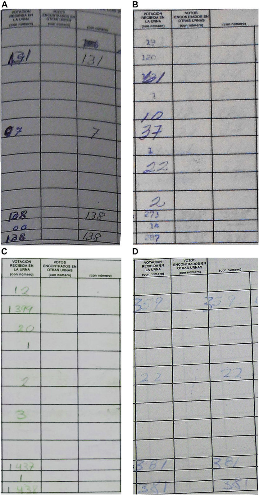

```{r setup, include=FALSE}
knitr::opts_chunk$set(echo = TRUE, message = FALSE, echo = FALSE, warning = FALSE)
```

## General Introduction

In this Problem Set, you will apply data science skills to wrangle and visualize the replication data of the following research article:

Cantú, F. (2019). The fingerprints of fraud: Evidence from Mexico's 1988 presidential election. *American Political Science Review*, *113*(3), 710-726.

## Requirements and Reminders

-   You are required to use **RMarkdown** to compile your answer to this Problem Set.

-   Two submissions are required (via Moodle)

    -   A `.pdf` file rendered by `Rmarkdown` that contains all your answer.

    -   A compressed (in `.zip` format) R project repo. The expectation is that the instructor can unzip, open the project file, knitr your `.Rmd` file, and obtain the exact same output as the submitted `.pdf` document.

-   The Problem Set is worth 30 points in total, allocated across 7 tasks. The point distribution across tasks is specified in the title line of each task. Within each task, the points are evenly distributed across sub-tasks. Bonus points (+5% max.) will be awarded to recognize exceptional performance.

-   Grading rubrics: Overall, your answer will be evaluated based on its quality in three dimensions

    -   Correctness and beauty of your outputs

    -   Style of your code

    -   Insightfulness of your interpretation or discussion

-   Unless otherwise specified, you are required to use functions from the `tidyverse` package to complete this assignments.

-   Fo some tasks, they may be multiple ways to achieve the same desired outcomes. You are encouraged to explore multiple methods. If you perform a task using multiple methods, do show it in your submission. You may earn bonus points for it.

-   You are encouraged to use Generative AI such as ChatGPT to assist with your work. However, you will need to acknowledge it properly and validate AI's outputs. You may attach selected chat history with the AI you use and describe how it helps you get the work done. Extra credit may be rewarded to recognize creative use of Generative AI.

-   This Problem Set is an individual assignment. You are expected to complete it independently. Clarification questions are welcome. Discussions on concepts and techniques related to the Problem Set among peers is encouraged. However, without the instructor's consent, sharing (sending and requesting) code and text that complete the entirety of a task is prohibited. You are strongly encouraged to use *CampusWire* for clarification questions and discussions.

\clearpage

## Background

In 1998, Mexico had a close presidential election. Irregularities were detected around the country during the voting process. For example, when 2% of the vote tallies had been counted, the preliminary results showed the PRI's imminent defeat in Mexico City metropolitan area and a very narrow vote margin between PRI and FDN. A few minutes later, the screens at the Ministry of Interior went blank, an event that electoral authorities justified as a technical problem caused by an overload on telephone lines. The vote count was therefore suspended for three days, despite the fact that opposition representatives found a computer in the basement that continued to receive electoral results. Three days later, the vote count resumed, and soon the official announced PRI's winning with 50.4% of the vote.

*What happened on that night and the following days? Were there electoral fraud during the election?* A political scientist, Francisco Cantú, unearths a promising dataset that could provide some clues. At the National Archive in Mexico City, Cantú discovered about 53,000 vote tally sheets. Using machine learning methods, he detected that a significant number of tally sheets were *altered*! In addition, he found evidence that the altered tally sheets were biased in favor of the incumbent party. In this Problem Set, you will use Cantú's replication dossier to replicate and extend his data work.

Please read Cantú (2019) for the full story. And see Figure 1 for a few examples of altered (fraudulent) tallies.

{width="260"}

\clearpage

## Task 0. Loading required packages (3pt)

For Better organization, it is a good habit to load all required packages up front at the start of your document. Please load the all packages you use throughout the whole Problem Set here.

```{r, echo=TRUE}
library(tidyverse)
library(ggplot2)
library(ggrepel)
library(sf)
library(cartogram)
```

\clearpage

## Task 1. Clean machine classification results (3pt)

Cantú applys machine learning models to 55,334 images of tally sheets to detect signs of fraud (i.e., alteration). The machine learning model returns results recorded in a table. The information in this table is messy and requires data wrangling before we can use them.

### Task 1.1. Load classified images of tally sheets

The path of the classified images of tally sheets is `data/classification.txt`. Your first task is loading these data onto R using a `tidyverse` function. Name it `d_tally`.

Note:

-   Although the file extension of this dataset is `.txt`, you are recommended to use the `tidyverse` function we use for `.csv` files to read it.

-   Unlike the data files we have read in class, this table has *no column names*. Look up the documentation and find a way to handle it.

-   There will be three columns in this dataset, name them `name_image`, `label`, and `probability`.

Print your table to show your output.

```{r, echo=TRUE}

d_tally <- read_csv("data/classification.txt",
                    col_names = c("name_image", "label", "probability"))

print(d_tally)

# creating duplicates for different methods demonstration below

d_tally2 <- d_tally
d_tally3 <- d_tally
```

\clearpage

### Note 1. What are in this dataset?

Before you proceed, let me explain the meaning of the three variables.

-   `name_image` contains the names of of the tallies' image files (as you may infer from the `.jpg` file extensions. They contain information about the locations where each of the tally sheets are produced.

-   `label` is a machine-predicted label indicating whether a tally is fraudulent or not. `label = 1` means the machine learning model has detected signs of fraud in the tally sheet. `label = 0` means the machine detects no sign of fraud in the tally sheet. In short, `label = 1` means fraud; `label = 0` means no fraud.

-   `probability` indicates the machine's certainty about its predicted `label` (explained above). It ranges from 0 to 1, where higher values mean higher level of certainty.

Interpret `label` and `probability` carefully. Two examples can hopefully give you clues about their correct interpretation. In the first row, `label = 0` and `probability = 0.9991`. That means the machine thinks this tally sheet is NOT FRAUDULENT with a probability of 0.9991. Then, the probability that this tally sheet is fraudulent is `1 - 0.9991 = 0.0009`. Take another example, in the 11th row, `label = 1` and `probability = 0.935`. This means the machine thinks this tally sheet IS FRAUDULENT with a probability of 0.935. Then, the probability that it is NOT FRAUDULENT is `1 - 0.9354 = 0.0646`.

\clearpage

### Task 1.2. Clean columns `label` and `probability`

As you have seen in the printed outputs, columns `label` and `probability` are read as `chr` variables when they are actually numbers. A close look at the data may tell you why --- they are "wrapped" by some non-numeric characters. In this task, you will clean these two variables and make them valid numeric variables. You are required to use `tidyverse` operations to for this task. Show appropriate summary statistics of `label` and `probability` respectively after you have transformed them into numeric variables.

```{r, echo=TRUE}

# clean the variables and make them into valid numeric variables

d_tally <- d_tally |>
  mutate(label = parse_number(label)) |>
  mutate(probability = parse_number(probability))

print(d_tally)

# show summary statistics (ask whether needs saving)

# counting the number of predicted fraud and non-fraud cases

d_tally |> count(label == 0)

# average confidence in predicting (ISSUE HERE)


# updating unused duplicates

d_tally2 <- d_tally
d_tally3 <- d_tally
```

\clearpage

### Task 1.3. Extract state and district information from `name_image`

As explained in the note, the column `name_image`, which has the names of tally sheets' images, contains information about locations where the tally sheets are produced. Specifically, the first two elements of these file names indicates the **states'** and districts' identifiers respectively, for example, `name_image = "Aguascalientes_I_2014-05-26 00.00.10.jpg"`. It means this tally sheet is produced in state **`Aguascalientes`**, district **`I`**. In this task, you are required to obtain this information. Specifically, create two columns named `state` and `district` as state and district identifiers respectively. You are required to use `tidyverse` functions to perform the task.

```{r, echo=TRUE}

# Method 1 (stringr::strsplit)

split_col <- strsplit(d_tally$name_image, "_")

d_tally <- d_tally |>
  mutate("state" = sapply(split_col, "[", 1)) |>
  mutate("district" = sapply(split_col, "[", 2))

print(d_tally)

# Method 2 (separate)

d_tally2 <- d_tally2 |>
  mutate("dup_column" = name_image) |> # duplicate column for separation
  separate(dup_column, into = c("state", "district"), sep = "_", extra = "drop")

print(d_tally2)

# updating unused duplicates
d_tally3 <- d_tally
```

**[Acknowledgement]** Use of ChatGPT

I asked ChatGPT about separating names and learned the two methods from it. However, the question was very general, and I wrote the code for this question myself.

\clearpage

### Task 1.4. Re-code a state's name

One of the states (in the newly created column `state`) is coded as "`Estado de Mexico`." The researchers decide that it should instead re-coded as "**`Edomex`**." Please use a `tidyverse` function to perform this task.

Hint: Look up functions `ifelse` and `case_match`.

```{r, echo=TRUE}

# Method 1: ifelse

d_tally <- d_tally |>
  mutate(state = ifelse(state == "Estado de Mexico", "Edomex", state))

# Method 2: case_match

d_tally2 <- d_tally2 |>
  mutate(state = case_match(
    state,
    "Estado de Mexico" ~ "Edomex",
    .default = state
  ))
  

# Method 3: recode

d_tally3 <- d_tally3 |>
  mutate(state = recode(state, "Estado de Mexico" = "Edomex"))

# No unused duplicates
```

**[Acknowledgement]** Use of ChatGPT

I asked ChatGPT about recoding objects and learned the three methods from it. However, the question was very general, and I wrote the code for this question myself.

\clearpage

### Task 1.5. Create a *probability of fraud* indicator

As explained in Note 1, we need to interpret `label` and `probability` with caution, as the meaning of `probability` is conditional on the value of `label`. To avoid confusion in the analysis, your next task is to create a column named `fraud_proba` which indicates the probability that a tally sheet is fraudulent. After you have created the column, drop the `label` and `probability` columns.

*Hint: Look up the `ifelse` function and the `case_when` function (but you just need either one of them).*

```{r, echo=TRUE}

# Method 1: ifelse

d_tally <- d_tally |>
  mutate("fraud_proba" = ifelse(label == 1, probability, 1-probability)) |>
  select(-label, -probability)

print(d_tally)

# Method 2: case_when

d_tally2 <- d_tally2 |>
  mutate("fraud_proba" = case_match(
    label,
    1 ~ probability,
    0 ~ 1 - probability
  )) |>
  select(-label, -probability)

print(d_tally2)

# updating unused duplicates
d_tally3 <- d_tally
```

\clearpage

### Task 1.6. Create a binary *fraud* indicator

In this task, you will create a binary indicator called `fraud_bin` in indicating whether a tally sheet is fraudulent. Following the researcher's rule, we consider a tally sheet fraudulent only when the machine thinks it is at least 2/3 likely to be fraudulent. That is, `fraud_bin` is set to TRUE when `fraud_proba` is greater to `2/3` and is FALSE otherwise.

```{r, echo=TRUE}

# Method 1: ifelse

d_tally <- d_tally |>
  mutate("fraud_bin" = ifelse(fraud_proba > 2/3, TRUE, FALSE))
print(d_tally)

# Method 2: case_when (case_match doesn't support formulas)

d_tally2 <- d_tally2 |>
  mutate("fraud_bin" = case_when(
    fraud_proba > 2/3 ~ TRUE,
    fraud_proba <= 2/3 ~ FALSE
  ))
print(d_tally2)

# updating unused duplicates
d_tally3 <- d_tally
```

\clearpage

## Task 2. Visualize machine classification results (3pt)

In this section, you will visualize the `tally` dataset that you have cleaned in Task 1. Unless otherwise specified, you are required to use the `ggplot` packages to perform all the tasks.

### Task 2.1. Visualize distribution of `fraud_proba`

How is the predicted probability of fraud (`fraud_proba`) distributed? Use two methods to visualize the distribution. Remember to add informative labels to the figure. Describe the plot with a few sentences.

```{r, echo=TRUE, fig.width=5, fig.height=4, out.width="50%", fig.align='center'}

ggplot(d_tally, aes(x = fraud_proba)) +
  geom_histogram(fill = "lightskyblue",
                 color = "white") +
  labs(title = "Distribution of the Probability of Fraud",
       x = "Probability of Fraud",
       y = "Number of Cases") +
  theme_bw()

```

Interpretation: Using histogram, we can see that most cases are concentrated in the two ends (0.00 and 1.00), with few in the middle. This show that we can be certain for most cases to be either fraud or not.

```{r, echo=TRUE, fig.width=5, fig.height=4, out.width="50%", fig.align='center'}

ggplot(d_tally2, aes(x = fraud_proba)) +
  geom_density() +
  labs(title = "Distribution of the Probability of Fraud",
       x = "Probability of Fraud",
       y = "Density") +
  theme_bw()

```

Interpretation: Using density plot, we can see that the probability of the cases to have 0.00 or 1.00 fraud probability is high, and that of the middle range is low. This show that we can be certain for most cases to be either fraud or not.

\clearpage

### Task 2.2. Visualize distribution of `fraud_bin`

How many tally sheets are fraudulent and how many are not? We may answer this question by visualizing the binary indicator of tally-level states of fraud. Use at least two methods to visualize the distribution of `fraud_bin`. Remember to add informative labels to the figure. Describe your plots with a few sentences.

```{r, echo=TRUE, fig.width=5, fig.height=4, out.width="50%", fig.align='center'}

d_tally |>
  mutate(fraud_bin = ifelse(fraud_bin == "TRUE", "Fraud", "Not Fraud")) |>
  ggplot(aes(x = fraud_bin, fill = fraud_bin)) +
  geom_bar() +
  labs(x = "Fraud?", y = "Number of Cases", fill = "", title = "Distribution of Fraud Tallies") +
  scale_fill_manual(values = c("orange", "lightblue")) +
  theme_bw() +
  theme(legend.position = "none")
```

Interpretation: Using bar chart, we can see that around 17,000 tallies are fraud, and a lot more cases (around 38,000) are not fraud.

```{r, echo=TRUE, fig.width=5, fig.height=4, out.width="50%", fig.align='center'}
  
d_tally2 <- d_tally2 |> group_by(fraud_bin) |> count()

d_tally2 |>
  mutate(fraud_bin = ifelse(fraud_bin == "TRUE", "Fraud", "Not Fraud")) |>
  ggplot(aes(x = "", y = n, fill = fraud_bin)) +
  geom_col() +
  coord_polar(theta = "y") +
  labs(fill = "Fraud?") +
  geom_text(aes(label = paste0(round(n/sum(n)*100), "%")),
            position = position_stack(vjust = 0.5)) +
  geom_text_repel(aes(label = paste0(n, "tallies")),
                  position = position_stack(vjust = 0.5)) +
  scale_fill_manual(values = c("orange", "lightblue")) +
  labs(title = "Distribution of Fraud Tallies") +
  theme_void()

```

Interpretation: This pie chart shows the percentage and actual amount for the two categories. That is, 16,985 tallies are fraud, accounting for 31% of total tallies; 38,349 tallies are not fraud, accounting for 69% of the total tallies.

\clearpage

### Task 2.3. Summarize prevalence of fraud by state

Next, we will examine the between-state variation with regards to the prevalence of election fraud. In this task, you will create a new object that contains two state-level indicators regarding the prevalence of election fraud: The count of fraudulent tallies and the proportion of fraudulent tallies.

```{r, echo=TRUE}

d_tally <- d_tally |>
  group_by(state) |>
  summarise(n_fraud = sum(fraud_bin == TRUE),
            prop_fraud = mean(fraud_bin)*100)
print(d_tally)
```

\clearpage

### Task 2.4. Visualize frequencies of fraud by state

Using the new data frame created in Task 2.3, please visualize the *frequencies* of fraudulent tallies of every state. Describe the key takeaway from the visualization with a few sentences.

Feel free to try alternative approach(es) to make your visualization nicer and more informative.

```{r, echo=TRUE}

d_tally |>
  ggplot(aes(x = reorder(state, n_fraud), y = n_fraud)) +
  geom_bar(stat = "identity") +
  coord_flip() +
  labs(title = "Prevalence of Fraud",
       x = "State",
       y = "Number of Fradulent Tally Sheets") +
  theme_bw()

```

Findings: There is a great variation of prevalence of fraud across states. Only 5 states has over 1,000 fraud cases. Notably, Veracruz has significantly more fraud than others, having over 2,000 fraud cases.

\clearpage

### Task 2.5. Visualize proportions of fraud by state

Using the new data frame created in Task 2.3, please visualize the *proportion of* of fraudulent tallies of every state. Describe the key takeaway from the visualization with a few sentences.

Feel free to try alternative approach(es) to make your visualization nicer and more informative.

```{r, echo=TRUE}

d_tally |>
  ggplot(aes(x = reorder(state, prop_fraud), y = prop_fraud)) +
  geom_bar(stat = "identity") +
  coord_flip() +
  labs(title = "Prevalence of Fraud",
       x = "State",
       y = "Percentage of Fradulent Tally Sheets") +
  theme_bw()

```

Findings: The variations of percentage is less across state compared to variation of absolute incidents. The order is also different. Tlaxcala has the highest percentage of fraud, while Distrito Federal has the lowest.

\clearpage

### Task 2.6. Visualize both proportions & frequencies of fraud by state

Create data visualization to show BOTH the *proportions* and *frequencies* of fraudulent tally sheets by state in one figure. Include annotations to highlight states with the highest level of fraud. Add informative labels to the figure. Describe the takeaways from the figure with a few sentences.

```{r, echo=TRUE, fig.width=8, fig.height=6, out.width="90%", fig.align='center'}

d_tally |> mutate(color = ifelse(d_tally$n_fraud < 1000, "low", "high")) |> ggplot() +
  geom_point(aes(y = reorder(state, prop_fraud),
                 x = prop_fraud, size = n_fraud,
                 color = color), alpha = 0.7) +
  geom_segment(aes(x = 0, xend = prop_fraud,
                   y = reorder(state, prop_fraud), yend = reorder(state, prop_fraud))) +
  scale_color_manual(values = c("red", "black"), labels = c("Yes", "No")) +
  scale_size(range = c(1,8)) +
  geom_vline(aes(xintercept = 49), linetype = "dashed", color = "red") +
  geom_text(aes(x = 50, y = 15, label = "Over 50%\nFraud"), hjust = 0, color = "red") +
  theme_classic() +
  guides(color = guide_legend(order = 2), size = guide_legend(order = 1)) +
  labs(x = "Percentage of Fradulent Tally Sheets", y = "States",
       title = "States with the Highest Level of Fraud",
       size = "Number of\nFraud Tally\nSheets",
       color = "Number of Fraud\nTally Sheets\n> 1000?") +
  theme(legend.position = "bottom", legend.justification = "left")

```

Takeaways: This graph combines both number and percentage of fraudulent tally sheets, with the x-axis representing percentage, and the size of the point representing absolute number.

-   5 states with more than 1,000 tallies are highlighted in red.

-   10 states with more than 50% fraud are annotated with a dash line.

-   From this graph, we can know that Oaxaca, Veracruz, Nuevo Leon, and Puebla are four states with the highest level of fraud (both over 1,000 tallies and 50% fraud).

[**Acknowledgement**] Use of ChatGPT

I asked ChatGPT for inspiration for this graph. It suggested: point graph with sizes, point graph with colors, side by side bar chart, bar chart and point chart. I experimented with all suggestions and landed on the first one. I wrote the code largely independently.

\clearpage

## Task 3. Clean vote return data (3pt)

Your next task is to clean a different dataset from the researchers' replication dossier. Its path is `data/Mexican_Election_Fraud/dataverse/VoteReturns.csv`. This dataset contains information about vote returns recorded in every tally sheet. This dataset is essential for the replication of Figure 4 in the research article.

### Task 3.1. Load vote return data

Load the dataset onto your R environment. Name this dataset `d_return`. Show summary statistics of this dataset and describe the takeaways using a few sentences.

```{r, echo=TRUE}

d_return <- read_csv("data/VoteReturns.csv")
print(d_return)

# number of columns that have character variable
sum(sapply(d_return, is.character))

# number of columns that have numeric variable
sum(sapply(d_return, is.numeric))

# number of NA data
sum(is.na(d_return))

# number of effective data
sum(!is.na(d_return))

# percentage of NA data
sum(is.na(d_return)) / (sum(is.na(d_return)) + sum(!is.na(d_return)))

```

Takeaways:

-   This dataset has 53,499 rows and 91 columns.

-   32 columns are characters, and 59 are numeric.

-   257,601 data is NA, accounting for around 5%, and 4,610,808 data is effective.

\clearpage

### Note 2. What are in this dataset?

This table contains a lot of different variables. The researcher offers no comprehensive documentation to tell us what every column means. For the sake of this problem set, you only need to know the meanings of the following columns:

-   `foto` is an identifier of the images of tally sheets in this dataset. We will need it to merge this dataset with the `d_tally` data.

-   `edo` contains the names of states.

-   `dto` contains the names of districts (in Arabic numbers).

-   `salinas`, `clouthier`, and `ibarra` contain the counts of votes (as recorded in the tally sheets) for presidential candidates Salinas (PRI), Cardenas (FDN), and Clouthier (PAN). In addition, the summation of all three makes the total number of **presidential votes**.

-   `total` contains the total number of **legislative votes**.

\clearpage

### Task 3.2. Recode names of states

A state whose name is `Chihuahua` is mislabelled as `Chihuhua`. A state whose name is currently `Edomex` needs to be recoded to `Estado de Mexico`. Please re-code the names of these two states accordingly.

```{r, echo=TRUE}

d_return <- d_return |>
  mutate(edo = ifelse(edo == "Edomex", "Estado de Mexico", edo),
         edo = ifelse(edo == "Chihuhua", "Chihuahua", edo))

d_return |>
  filter(edo == "Estado de Mexico") |>
  select(edo) |>
  print()

d_return |>
  filter(edo == "Chihuahua") |>
  select(edo) |>
  print()
```

\clearpage

### Task 3.3. Recode districts' identifiers

Compare how districts' identifiers are recorded differently in the tally (`d_tally`) from vote return (`d_return`) datasets. Specifically, in the `d_tally` dataset, `district` contains Roman numbers while in the `d_return` dataset, `dto` contains Arabic numbers. Recode districts' identifiers [in the `d_return` dataset]{.underline} to match those in the `d_tally` dataset. To complete this task, first summarize the values of the two district identifier columns in the two datasets respectively to verify the above claim. Then do the requested conversion.

```{r, echo=TRUE}

# converting the district column in d_tally to "roman" from "character"
d_tally3$district <- as.roman(d_tally3$district)

# verify claim: d_tally roman & d_return arabic
class(d_tally3$district)
class(d_return$dto)

# summarise the values in d_tally
summary(as.numeric(d_tally3$district))
table(as.numeric(d_tally3$district))

# summarise the values in d_return
summary(d_return$dto)
table(d_return$dto)

# converting district identifier in d_return from Arabic to Roman
d_return$dto <- as.roman(d_return$dto)
print(d_return)
```

\clearpage

### Task 3.4. Create a `name_image` identifier for the `d_return` dataset

In the `d_return` dataset, create a column named `name_image` as the first column. The column concatenate values in the three columns: `edo`, `dto`, and `foto` with an underscore `_` as separators.

```{r, echo=TRUE}

d_return <- d_return |>
  mutate(name_image = paste(edo, dto, foto, sep = "_"), .before = 1)
  
# selecting four columns to print
d_return |> select(name_image, edo, dto, foto) |> print()

```

\clearpage

### Task 3.5. Wrangle the `name_image` column in two datasets

As a final step before merging `d_return` and `d_tally`, you are required to perform the following data wrangling. For the `name_image` column in BOTH `d_return` and `d_tally`:

-   Convert all characters to lower case.

-   Remove ending substring `.jpg`.

```{r, echo=TRUE}

# convert all to lower case
d_tally3$name_image <- tolower(d_tally3$name_image)
d_return$name_image <- tolower(d_return$name_image)

# removing .jpg
d_tally3 <- d_tally3 |>
  mutate(name_image = str_remove(name_image, "\\.jpg$"))
d_return <- d_return |>
  mutate(name_image = str_remove(name_image, "\\.jpg$"))

# print result
d_tally3 |> select(name_image) |> print()
d_return |> select(name_image) |> print()
```

\clearpage

### Task 3.6 Join classification results and vote returns

After you have successfully completed all the previous steps, join `d_return` and `d_tally` by column `name_image`. This task contains two part. First, use appropriate `tidyverse` functions to answer the following questions:

-   How many rows are in `d_return` but not in `d_tally`? Which states and districts are they from?

-   How many rows are in `d_tally` but not in `d_return`? Which states and districts are they from?

```{r, echo=TRUE}

# only in d_return
d_return_only <- d_return |>
  anti_join(d_tally3, by = "name_image") |>
  select(edo, dto) |>
  distinct()
print(d_return_only)

# only in d_tally
d_tally_only <- d_tally3 |>
  anti_join(d_return, by = "name_image") |>
  select(state, district) |>
  distinct()
print(d_tally_only)
```

Therefore, 129 rows are only in `d_return`, and 240 only in `d_tally`.

Second, create a dataset call `d` by joining `d_return` and `d_tally` by column `name_image`. `d` contains rows whose identifiers appear in *both* datasets and columns from *both* datasets.

```{r, echo=TRUE}

d <- inner_join(d_return, d_tally3, by = "name_image")
print(d)
```

\clearpage

## Task 4. Visualize distributions of fraudulent tallies across candidates (6pt)

In this task, you will visualize the distributions of fraudulent tally sheets across three presidential candidates: **Sarinas (PRI)**, **Cardenas (FDN)**, and **Clouthier (PAN)**. The desired output of is reproducing and extending Figure 4 in the research article (Cantu 2019, pp. 720).

### Task 4.1. Calculate vote proportions of Salinas, Clouthier, and Cardenas

Before getting to the visualization, you should first calculate the proportion of votes (among all) received by the three candidates of interest. As additional background information, there are two more presidential candidates in this election, whose votes received are recorded in `ibarra` and `castillo` respectively. Please perform the tasks in the following two steps on the `d` dataset:

-   Create a new column named `total_president` as an indicator of the total number of votes of the 5 presidential candidates.

-   Create three columns `salinas_prop`, `cardenas_prop`, and `clouthier_prop` that indicate the proportions of the votes these three candidates receive respectively.

```{r, echo=TRUE}

# adding total_president
d <- d |>
  mutate(total_president = salinas + cardenas + clouthier + castillo + ibarra)

d |> select(total_president, salinas, cardenas, clouthier, castillo, ibarra) |>
  print()

# adding proportions columns
d <- d |>
  mutate (salinas_prop = salinas / total_president,
          cardenas_prop = cardenas / total_president,
          clouthier_prop = clouthier / total_president)

d |> select(salinas_prop, cardenas_prop, clouthier_prop) |> print()
```

\clearpage

### Task 4.2. Replicate Figure 4

Based on all the previous step, reproduce Figure 4 in Cantu (2019, pp. 720).

Note: Your performance in this task will be mainly evaluated based on your output's similarity with the original figure. Pay attention to the details. For your reference, below is a version created by the instructor.

```{r, echo=TRUE, tidy = FALSE, width = 80, fig.width=4.5, fig.height=5, out.width="80%", fig.align='center'}

# prepare dataset
d_long <- d |>
  pivot_longer(cols = ends_with("prop"),
               names_to = "Candidates",
               values_to = "Value") |>
  mutate(fraud_bin = as.character(fraud_bin)) |>
  mutate(Candidates = ifelse(Candidates == "salinas_prop",
                             "Salinas (PRI)", Candidates)) |>
  mutate(Candidates = ifelse(Candidates == "cardenas_prop",
                             "Cardenas (FDN)", Candidates)) |>
  mutate(Candidates = ifelse(Candidates == "clouthier_prop",
                             "Clouthier (PAN)", Candidates))
  

# have "TRUE" appear in front of "FALSE" while overlapping density plot
d_long$fraud_bin <- factor(d_long$fraud_bin, levels = c("TRUE", "FALSE"))


# make plot
d_long |>
  ggplot(aes(x = Value)) +
  geom_density(aes(fill = fraud_bin, linetype = fraud_bin, color = fraud_bin),
               alpha = 0.5) +
  facet_wrap(~ factor(Candidates, level = c("Salinas (PRI)",
                                            "Cardenas (FDN)", 
                                            "Clouthier (PAN)")),
             scales = "free_y", ncol = 1, strip.position = "right") +
  scale_linetype_manual(values = c("dashed", "solid"),
                        labels = c("Tallies\nidentified with\nalterations",
                                   "Tallies\nidentified with\nno alterations")) +
  scale_fill_manual(values = c("orange", "lightskyblue"),
                    labels = c("Tallies\nidentified with\nalterations",
                               "Tallies\nidentified with\nno alterations")) +
  scale_color_manual(values = c("orange", "lightskyblue"),
                    labels = c("Tallies\nidentified with\nalterations",
                               "Tallies\nidentified with\nno alterations")) +
  theme_bw() +
  labs(x = "Vote share", y = "Density") +
  theme(legend.title = element_blank())

```

**[Acknowledgement]** Use of ChatGPT (only parts of GPT's answers are shown)

*Question*: In R, for ggplot, is there a way to combine multiple columns for x, but to create different facets for each column?

*Relevant Answer*: Yes, in `ggplot2`, you can use the `facet_wrap()` function to create different facets for each column while combining multiple columns for the x-axis. Here's an example:

```{r, echo=TRUE, eval=FALSE, tidy = FALSE}

# Create a sample data frame
df <- data.frame(
  x1 = rnorm(100),
  x2 = rnorm(100),
  x3 = rnorm(100),
  y = rnorm(100)
)

# Convert the data frame to long format
df_long <- tidyr::pivot_longer(df, cols = starts_with("x"),
                               names_to = "Variable",
                               values_to = "Value")

# Create a ggplot with facets for each column and combine multiple columns for x-axis
p <- ggplot(df_long, aes(x = Value, y = y)) +
  geom_point() +
  facet_wrap(~ Variable, scales = "free_x", ncol = 1)
```

*Question:* What does "free_x" mean?

*Relevant Answer*: The `scales` argument can take several values. One of them is `free_x`, which means that each facet will have its own x-axis scale, independent of the other facets. This is useful when the ranges of the x variable differ greatly between facets, as it allows each facet to be zoomed in on its own range. Similarly, `free_y` can be used to allow each facet to have its own y-axis scale.

I also used ChatGPT for the aesthetics, but it was misleading most of the time :( and I ended up solving most problems through Google.

\clearpage

### Task 4.3. Discuss and extend the reproduced figure

Referring to your reproduced figures and the research articles, in what way is the researcher's argument supported by this figure? Make an alternative visualization design that can substantiate and even augment the current argument. After you have shown your alternative design, in a few sentences, describe how your design provides visual aid as effectively as or more effectively than the original figure.

**Note:** Feel free to make *multiple* alternative designs to earn bonus credits. However, please be selective. Only a design with major differences from the existing ones can be counted as an alternative design.

**Answer**: The main argument for the Figure 4 is:

-   For Salinas: "This comparison suggests not only that the altered tallies present larger vote shares than those tallies without alterations, but also that many of them gave Salinas almost unanimous support" (p 719).

This is supported by the graph as it shows how Salinas' altered tallies concentrate in the parts with large vote share, contrasting the others.

-   For Cardenas: "[T]he vote shares are considerably lower among the tallies classified as fraudulent than among those classified as clean" (p 719).

This is supported by the graph as it shows that Cardenas' tallies have a high possibility of being altered in the lowest end of the vote share.

```{r, echo=TRUE, tidy = FALSE,fig.width=10, fig.height=5, fig.align='center'}

d_long |>
  mutate(fraud_bin = ifelse(fraud_bin == "TRUE", "With Alterations", "No Alterations")) |>
  ggplot(aes(x = Value)) +
  geom_density(aes(color = Candidates)) +
  facet_grid(~ factor(fraud_bin)) +
  scale_color_brewer(palette = "Dark2") +
  labs(x = "Vote share", y = "Density") +
  theme_minimal()

```

#### Design 1: Alternative Density Graph

From this graph, instead of faceting through `Candidates`, it facets through `fraud_bin`, and the two graphs share the same y-axis. This allows us to compare between the candidates straightforwardly through the same scale. It shows:

-   Salinas (PRI)'s altered tallies concentrate in high vote share areas, giving him a strong advantage over the opponents.

-   Clouthier (PAN)'s tallies have a higher possibility of fraud than not fraud for himself, and higher possibility of fraud than the other candidates when vote share is low.

```{r, echo=TRUE, tidy = FALSE,fig.width=4.5, fig.height=5, out.width="80%", fig.align='center'}
d_long$fraud_bin <- factor(d_long$fraud_bin, levels = c("FALSE", "TRUE"))
d_long |> 
  ggplot(aes(x = Value, fill = fraud_bin)) +
  geom_histogram(color = "white") +
  facet_wrap(~ factor(Candidates, level = c("Salinas (PRI)",
                                            "Cardenas (FDN)",
                                            "Clouthier (PAN)")),
             scales = "free_y", ncol = 1, strip.position = "right") +
  scale_fill_manual(values = c("lightgrey", "darkred"),
                    labels = c("Tallies\nidentified with\nNO alterations",
                               "Tallies\nidentified WITH\nalterations")) +
  theme_classic() +
  labs(x = "Vote share", y = "Number of Tallies", fill = "")
```

#### Design 2: Histogram

From this stacked histogram, we can see the **actual number** of tallies for each candidates, as well as the vote share.

-   In terms of total tallies, we can see that Salinas has a great advantage on the higher vote share end than the other two candidates.

-   In terms of The fraudulent tallies, they marked in dark red at the bottom, showing a clear trend (growing for Salinas, declining for Cardenas and Clouthier).

\clearpage

## Task 5. Visualize the discrepancies between presidential and legislative Votes (6pt)

In this task, you will visualize the differences between the number of presidential votes across tallies. The desired output of is reproducing and extending Figure 5 in the research article (Cantu 2019, pp. 720).

### Task 5.1. Get district-level discrepancies and fraud data

As you might have noticed in the caption of Figure 5 in Cantu (2019, pp. 720), the visualized data are aggregated to the *district* level. In contrast, the unit of analysis in the dataset we are working with, `d`, is *tally*. As a result, the first step of this task is to aggregate the data. Specifically, please aggregate `d` into a new data frame named `sum_fraud_by_district`, which contains the following columns:

-   `state`: Names of states

-   `district`: Names of districts

-   `vote_president`: Total numbers of presidential votes

-   `vote_legislature`: Total numbers of legislative votes

-   `vote_diff`: Total number of presidential votes minus total number of legislative votes

-   `prop_fraud`: Proportions of fraudulent tallies (hint: using `fraud_bin`)

```{r, echo=TRUE}

sum_fraud_by_district <- d |>
  group_by(state, district) |>
  summarise(vote_president = sum(total_president),
         vote_legislature = sum(total),
         vote_diff = vote_president - vote_legislature,
         prop_fraud = mean(fraud_bin))

```

**[Acknowledgement]** Use of ChatGPT for `prop_fraud`:

*Question*: In R, there's a column that contains logical objects (TRUE and FALSE). There's another column that groups the data into districts (district 1, district 2, etc.) I want to create a new column that shows the proportion of TRUE out of all values in each district using `group_by()` and `summarize()`. How can I do it?

*Relevant answer*: Use the `summarize()` function to calculate the proportion of TRUE values in each district. You can use the `mean()` function to calculate the proportion. The resulting `df` data frame will contain the district column and the new column showing the proportion of TRUE values in each district.

\clearpage

### Task 5.2. Replicate Figure 5

Based on all the previous step, reproduce Figure 5 in Cantu (2019, pp. 720).

```{r, echo=TRUE, fig.width=6, fig.height=3.3, out.width="80%", fig.align='center'}

sum_fraud_by_district |>
  ggplot(aes(x = vote_legislature, y = vote_president)) +
  geom_point(aes(size = prop_fraud), alpha = 0.1, stroke = 0) +
  theme_bw() +
  labs(x = "Total Legislative Votes", y = "Total Presidential Vote",
       size = "Proportion of tallies\nidentified with\nalterations")

```

**Note 1:** Your performance in this task will be mainly evaluated based on your output's similarity with the original figure. Pay attention to the details.

**Note 2:** The instructor has detected some differences between the above figure with Figure 5 on the published article. Please use the instructor's version as your main benchmark.

\clearpage

### Task 5.3. Discuss and extend the reproduced figure

Referring to your reproduced figures and the research articles, in what way is the researcher's argument supported by this figure? Make an alternative visualization design that can substantiate and even augment the current argument. After you have shown your alternative design, in a few sentences, describe how your design provides visual aid as effectively as or more effectively than the original figure.

**Note:** Feel free to make *multiple* alternative designs to earn bonus credits. However, please be selective. Only a design with major differences from the existing ones can be counted as an alternative design.

**Answer**: The main argument for Figure 5 is: "Since voters received ballots for both elections, we expect to observe a similar number of votes for president and deputy in the district. However, there is a group of districts showing large discrepancies, all of them with more votes for the presidential election than for the legislative one." (p.719)

That is, districts with large vote differences are more likely to have a higher proportion of fraudulent tallies. The author's graph shows that as the districts with large difference between the two votes also have large sizes, indicating high fraudulent proportion.

```{r, echo=TRUE, fig.width=6, fig.height=3.3, fig.align='center'}

sum_fraud_by_district |>
  mutate(num = ifelse(vote_diff < 20000, "low", "high"),
         poss = ifelse(prop_fraud < 0.5, "no", "yes"),
         color = paste(num, poss, sep = "-")) |>
  ggplot(aes(x = vote_diff, y = prop_fraud)) +
  geom_point(aes(color = color), size = 3, alpha = 0.5) +
  scale_color_brewer(palette = "Set1") +
  labs(x = "Difference between Legislative and Presidential Votes",
       y = "Proportion of Fraudulent Tallies") +
  theme_bw() +
  theme(legend.position = "none")

```

#### Design 1: Colored Scatter Plot, vote difference vs. proportion of fraud

This scatter plot shows the relationship with this two variables, and divided the points along 1) 20,000 tally difference, and 2) 50% fraudulent line.

From this graph, one can clearly see that the three dots with more than 20,000 tally difference are all more than 50% fraudulent, supporting the author's argument.

```{r, echo=TRUE, fig.width=6, fig.height=3.3, fig.align='center'}
sum_fraud_by_district |>
  ggplot(aes(x = vote_legislature, y = vote_president)) +
  geom_point(aes(color = prop_fraud), size = 3, alpha = 0.8) +
  scale_color_gradient(low = "azure2", high = "red") +
  geom_smooth(method = "lm", color = "grey", alpha = 0.5, se = FALSE) +
  labs(x = "Total Legislative Votes", y = "Total Presidential Votes",
       color = "Proportion of tallies\nidentified with\nalterations") +
  theme_minimal()
```

#### Design 2: Colored Scatter Plot, legislative vote vs. presidential vote

This graph is more similar to the original graph, but allows one to see the situation in the concentrated area more clearly. It also includes a best-fit line to further improve clarity. One can see that the three points most further away from the best-fit line are all in deeper shade of red, but there is also a high prevelance of fraud even for dots close to the best-fit line.

\clearpage

## Task 6. Visualize the spatial distribution of fraud (6pt)

In this final task, you will visualize the spatial distribution of electoral fraud in Mexico. The desired output of is reproducing and extending Figure 3 in the research article (Cantu 2019, pp. 720).

### Note 3. Load map data

As you may recall, map data can be stored and shared in **two** ways. The simpler format is a table where each row has information of a point that "carves" the boundary of a geographic unit (a Mexican state in our case). In this type of map data, a geographic unit is is represented by multiple rows. Alternatively, a map can be represented by a more complicated and more powerful format, where each geographic unit (a Mexican state in our case) is represented by an element of a `geometry` column. For this task, I provide you with a state-level map of Mexico represented by both formats respectively.

Below the instructor provide you with the code to load the maps stored under the two formats respectively. Please run them before starting to work on your task.

```{r, echo=TRUE, results='hide'}

# Load map (simple)
map_mex <- read_csv("data/map_mexico/map_mexico.csv")
# Load map (sf): You need to install and load library "sf" in advance
map_mex_sf <- st_read("data/map_mexico/shapefile/gadm36_MEX_1.shp")
map_mex_sf <- st_simplify(map_mex_sf, dTolerance = 100)
```

**Bonus question**: Explain the operations on `map_mex_sf` in the instructor's code above.

**Note**: The map (sf) data we use are from <https://gadm.org/download_country_v3.html>.

**Answer to Bonus Question**:

`st_read()` is to read a file in shapefile format and creates a spatial object.

`st_simplify()` is to simplify the spatial object by reducing the number of points in the object's geometry. `dTolerance` specifies the level of simplification.

\clearpage

### Task 6.1. Reproduce Figure 3 with `map_mex`

In this task, you are required to reproduce Figure 3 with the `map_mex` data.

Note:

-   Your performance in this task will be mainly evaluated based on your output's similarity with the original figure. Pay attention to the details. For your reference, below is a version created by the instructor.

-   Hint: Check the states' names in the map data and the electoral fraud data. Recode them if necessary.

```{r, echo=TRUE}

# calculate state fraud through averaging districts
map_data <- sum_fraud_by_district |>
    group_by(state) |>
    summarise(fraud = mean(prop_fraud)) |>
    arrange(fraud)

# find out differences in state names
setdiff(map_data$state, map_mex$state_name)
setdiff(map_mex$state_name, map_data$state)

# renaming states to match
map_data <- map_data |>
  mutate(state = ifelse(state == "Yucatan", "Yucatán", state),
         state = ifelse(state == "Nuevo Leon", "Nuevo León", state),
         state = ifelse(state == "Michoacan", "Michoacán", state),
         state = ifelse(state == "Queretaro", "Querétaro", state),
         state = ifelse(state == "San Luis Potosi", "San Luis Potosí", state),
         state = ifelse(state == "Distrito Federal", "Ciudad de México", state),
         state = ifelse(state == "Edomex", "México", state))

# checking state name
setdiff(map_data$state, map_mex$state_name)

# combining map data and fraud data
map_combined <- map_mex |>
  left_join(map_data, by = c("state_name" = "state"))

# making map
map_combined |>
  ggplot(aes(x = long, y = lat)) +
  geom_map(
    map = map_combined,
    aes(map_id = id, fill = fraud),
    color = "black", linewidth = 0.1
  ) +
  scale_fill_gradient(low = "white", high = "grey17") +
  theme_void() +
  labs(fill = "Proportion\nof altered\ntallies") +
  theme(legend.position = c(.1,.25)) +
  coord_map()

```

\clearpage

### Task 6.2. Reproduce Figure 3 with `map_mex_sf`

In this task, you are required to reproduce Figure 3 with the `map_mex` data.

Note:

-   Your performance in this task will be mainly evaluated based on your output's similarity with the original figure. Pay attention to the details. For your reference, below is a version created by the instructor.

-   Hint: Check the states' names in the map data and the electoral fraud data. Recode them if necessary.

```{r, echo=TRUE}

# find out differences in state names
setdiff(map_data$state, map_mex_sf$NAME_1)
setdiff(map_mex_sf$NAME_1, map_data$state)

# renaming states to match & changing legend unit to match instructor's sample
map_data <- map_data |>
  mutate(state = ifelse(state == "Ciudad de México", "Distrito Federal", state)) |>
  mutate(fraud = fraud*100)

# checking state name
setdiff(map_data$state, map_mex_sf$NAME_1)

# combining map data and fraud data
map_combined_sf <- map_mex_sf |>
  left_join(map_data, by = c("NAME_1" = "state"))

# making map
map_combined_sf |> ggplot() +
  geom_sf(aes(fill = fraud), color = "black") +
  scale_fill_gradient(low = "white", high = "grey17") +
  theme_void() +
  labs(fill = "Proportion\nof altered\ntallies") +
  theme(legend.position = c(.1,.25)) +
  coord_sf()

```

\clearpage

### Task 6.3. Discuss and extend the reproduced figures

Referring to your reproduced figures and the research articles, in what way is the researcher's argument supported by this figure? Make an alternative visualization design that can substantiate and even augment the current argument. After you have shown your alternative design, in a few sentences, describe how your design provides visual aid as effectively as or more effectively than the original figure.

**Note:** Feel free to make *multiple* alternative designs to earn bonus credits. However, please be selective. Only a design with major differences from the existing ones can be counted as an alternative design.

**Answer**: The main argument for the map is: "[M]ost of the tallies with alterations are placed in the south of the country, a region distinguished by its legacy of subnational authoritarian enclaves during the last decade of the twentieth century" (p 718).

That is, southern Mexico has serious fraud issue. The map support this argument by having darker shades for the regions with more severe fraud.

```{r, echo=TRUE}
map_com_sf_severe <- map_combined_sf |>
  mutate(fraud = ifelse(fraud < 33.3, NA, fraud),
         NAME_1 = ifelse(fraud < 33.3, NA, NAME_1))

map_com_sf_severe |>
  ggplot() +
  geom_sf(aes(fill = fraud), color = "white") +
  scale_fill_gradient(low = "rosybrown1", high = "darkred") +
  geom_sf_text(data = subset(map_com_sf_severe,
                             NAME_1 != "San Luis Potosí" & NAME_1 != "Puebla"),
                             aes(label = NAME_1), size = 2) +
  ggrepel::geom_text_repel(data = subset(map_com_sf_severe,
                                         NAME_1 %in% c("San Luis Potosí", "Puebla")),
                           aes(label = NAME_1, geometry = geometry),
                           stat = "sf_coordinates",
                           min.segment.length = 0, size = 2,
                           segment.alpha = 0, direction = "both") +
  theme_void() +
  labs(fill = "Proportion\nof altered\ntallies") +
  theme(legend.position = c(.1,.25)) +
  coord_sf()
```

#### Design 1: Choropleth Map with Severe Fraud

This map only shows states with higher than 1/3 of fraudulent tallies, demonstrating better contrast between those with severe fraud and those that not. Furthermore, the there is a clearer difference among states with more than 1/3 fraud as well, as the range is smaller.

This map also adds state names for those with severe fraud, allowing somebody with little background of Mexican states to understand the map better.

```{r, echo=TRUE}

map_com_sf_do <- map_combined_sf |>
  mutate(geometry = st_transform(geometry, 3857)) |>
  cartogram_dorling(weight = "fraud")

map_com_sf_do |> ggplot() +
  geom_sf(aes(fill = fraud), color = "black") +
  scale_fill_gradient(low = "white", high = "red") +
  geom_sf_text(aes(label = NAME_1), size = 2.5) +
  theme_void() +
  labs(fill = "Proportion\nof altered\ntallies") +
  theme(legend.position = c(.1,.25)) +
  coord_sf()

```

#### Design 2: Diagrammic (Dorling) cartograms

This is more of a fun map (not that appropriate for academic paper, admittedly) that shows the level of fraud of different states through both their sizes and colors. Compared to normal cartograms, Dorling cartogram allows one to see the state names and their comparative influence more clearly.
